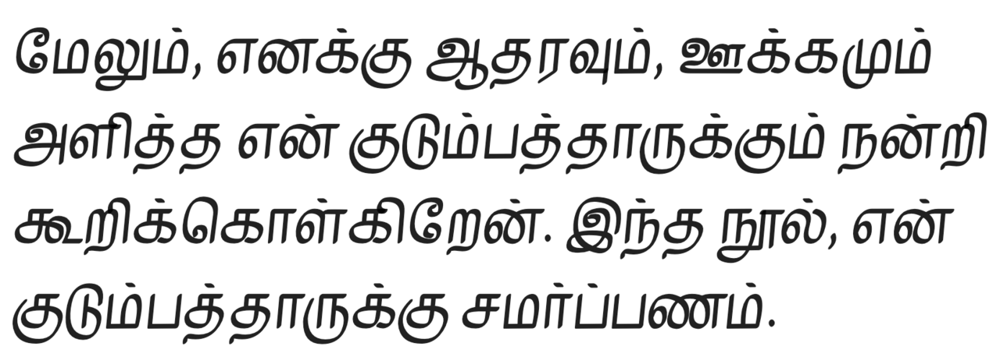

## 제 6 장🔗
------

[원문](https://thenetworkstate.com/acknowledgments)

# 감사의 말🔗

이 책이 만들어지기 위해 많은 노력이 필요했고, 나는 이 책이 태어날 수 있도록 나와 가까이 일한 사람들에게 감사를 표하고 싶다.

[@zane1729](https://twitter.com/zane1729)은 연구 및 팩트 체킹에서 교정 및 입력, 도판, 코드까지 책의 모든 측면을 도왔다. [@gfodor](https://twitter.com/gfodor)는 전자책 리더와 웹사이트 전체를 작성했다. [@jonst0kes](https://twitter.com/jonst0kes)는 출판 기념 NFT(역주: 안타깝게도 역자는 발라지의 출판 기념 NFT 트윗에 ENS 주소를 달았음에도 불구하고, NFT를 수신하는 데는 실패했다)를 코딩하고 커뮤니티를 관리했다. [@aaraalto](https://twitter.com/aaraalto)는 표지와 NFT 아트를 담당했다. [@elijahmadonia](https://dribbble.com/elijahmadonia)는 도판과 웹 디자인 작업을 맡았고, [@0FJAKE](https://twitter.com/0FJAKE)와 [@xenbh](https://twitter.com/xenbh)는 도서 유통을 도왔다. 이들의 기여는 매우 소중했다.

아, 그리고 한가지 더...

